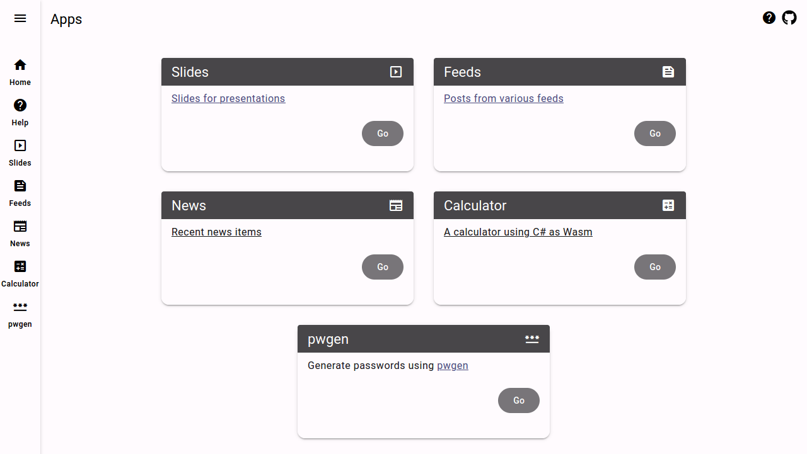

# [Apps](https://kherrick.github.io/apps/)

[Apps](/apps/) is a [progressive web app](https://developer.mozilla.org/en-US/docs/Web/Progressive_web_apps) that aims to adhere to the [App Shell model](https://angular.io/guide/app-shell). The primary routes are [prerendered](https://angular.io/guide/prerendering) as static HTML during the build process and are [loaded lazily](https://angular.io/guide/lazy-loading-ngmodules) at runtime to ensure a smaller client-side JavaScript bundle. The [source code](https://github.com/kherrick/apps) is hosted on [GitHub](https://github.com/) and comprises several components that operate within the [Angular](https://angular.io/) framework.

## Sections

* [News](https://kherrick.github.io/apps/news/) - Recent news items
* [Feeds](https://kherrick.github.io/apps/feeds/) - Posts from various feeds
* [Playground](https://kherrick.github.io/apps/playground/) - A playground for ideas and experimentation.
* [Links](https://kherrick.github.io/apps/links/) - Links to other sites
* [Slides](https://kherrick.github.io/apps/slides/) - Slides for presentations
* [About](https://kherrick.github.io/apps/about/) - What is this all about?

This project was generated with [Angular CLI](https://github.com/angular/angular-cli).

## Development server

Run `npm start` for a dev server. Navigate to `http://localhost:4200/`. The application will automatically reload if you change any of the source files.

## Build

Run `npm run build` to build the project. The build artifacts will be stored in the `dist/` directory.

## Running unit tests

Run `npm run test` to execute the unit tests via [Karma](https://karma-runner.github.io).

## Running end-to-end tests

Run `npm run ng e2e` to execute the end-to-end tests via a platform of your choice. To use this command, you need to first add a package that implements end-to-end testing capabilities.

## Further help

To get more help on the Angular CLI use `ng help` or go check out the [Angular CLI Overview and Command Reference](https://angular.dev/tools/cli) page.
